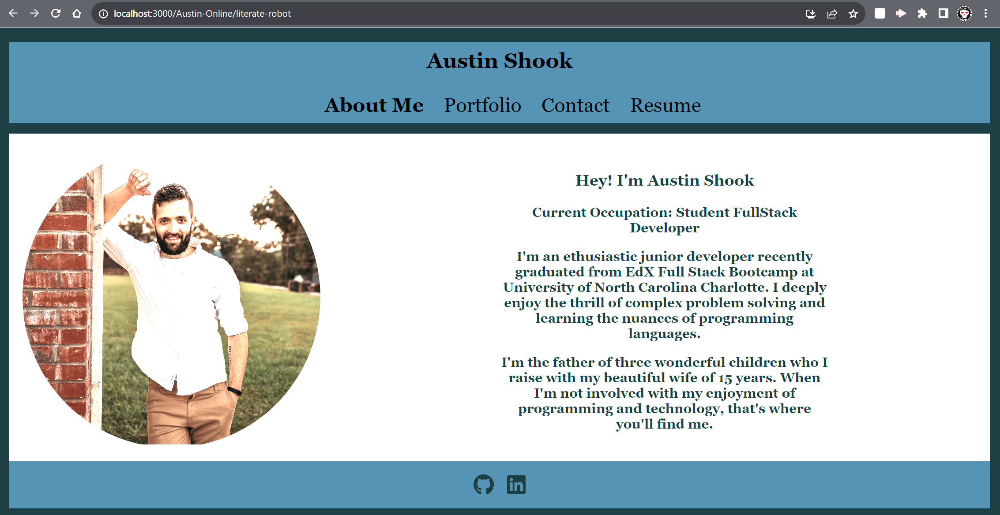

# React.js Portfolio

## Description
This is a React application for a portfolio for full stack development.

## Installation
-Clone the repository
-Open a terminal window and run 'npm install'
-Run the command 'npm start' to start the server.

## Usage
-After the server has been initialized, navigate to http://localhost:3001/ to run the web application.

## License
MIT License

Copyright (c) 2023 Austin-Online

Permission is hereby granted, free of charge, to any person obtaining a copy
of this software and associated documentation files (the "Software"), to deal
in the Software without restriction, including without limitation the rights
to use, copy, modify, merge, publish, distribute, sublicense, and/or sell
copies of the Software, and to permit persons to whom the Software is
furnished to do so, subject to the following conditions:

The above copyright notice and this permission notice shall be included in all
copies or substantial portions of the Software.